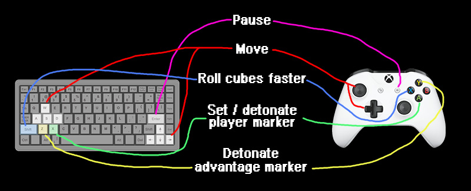

# Qube

This is a clone of the classic Playstation 1 puzzle game
[Intelligent Qube](https://en.wikipedia.org/wiki/I.Q.:_Intelligent_Qube).

# How to play

Try it out in the browser, here.

Or download it for PC, here.

You can see the `Controls` and `Game rules` screens within the game, but here are the controls anyways:

# Find any bugs? Want to contribute?

Feel free to open an issue, pull request, or fork this repo. I plan to work on other side projects (and also have a
full-time job), so I can't promise to actively maintain this project very much.

# Fun details

* The levels of this game are [scraped directly from the fantastically detailed Intelligent Qube FAQ](https://gamefaqs.gamespot.com/ps/197636-intelligent-qube/faqs/40016)
  .txt file by Syonyx on GameFAQs.com.
* I've tried out an event-driven architecture in most game play code involving interaction between world entities,
  with fairly good success. An example is that the rolling cubes in the world are subscribed via `public delegate`s like
  `MarkerDetonationEvent` to react using `MarkerDetonationSubscribed`.
* When cubes fall off the edge of the world, they switch on a simple rigid body physics simulation, to achieve the 
  random tumbling effect.

### Why did I create a clone of an existing games?

I did this to improve my knowledge of Unity and try out alternate implementations until I found one that is easily
changed, and straightforwardly fulfills the original game's rules.

### Why did I author this clone several times over, scrapping several nearly completed versions of it each time?

The first two iterations of this game involved a lot of unsatisfactory coupling between world entities.
I had too many "God" objects and implementing the game rules became cumbersome, until I hit upon the event-driven approach.

# Credits, borrowed open source, royalty free art

* Full credit on the original game and puzzle design to `G-Artists`, Masahiko Sato.
* Programming of this clone by me, Chris Butcher
* Sound effects are all from [OpenGameArt](opengameart.org/)
* [3D human model](https://opengameart.org/content/animated-human-low-poly) by Quaternius
* Music is by [Darker Waves by Zander Noriega](https://opengameart.org/content/darker-waves)
* Space skybox art by [Bright Shining Star](https://assetstore.unity.com/packages/2d/textures-materials/sky/3-skyboxes-25142)
* Pixel font by [Max](https://www.dafont.com/max.d967)